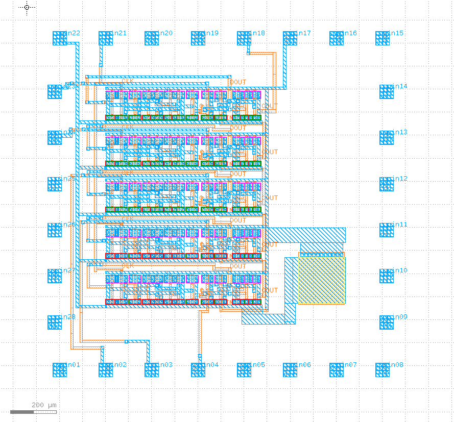

# minimalfab-design-contest-2024

This entry consists of a 5-stage binary ripple counter. A especially high logic density is achieved through special implementation of the D-Flip-Flop and XOR gate required for each stage.

The DFFs are implemented as two dynamic latches, meaning a capacitor (here in the form of inherent gate capacitance) is used to store a bit of information. This results in a compact (and fast) implementation requiring only 8 transistor pairs, but has the downside of the data in the DFF erasing itself due to self-discharge of the capacitance over time. This means a **minimum** clock speed of 2.5kHz is required to refresh the data in the DFF regularly.

Each counter stage requires one XOR and one AND gate to compute the next state and carry out. The AND gate is implemented as normal in CMOS, but the XOR gate uses a novel implementation only requiring two transistor pairs. Compared to a regular XOR implementation with 8 transistor pairs, this implementation has disadvantages in the areas of noise margin, input capacitance and rise/fall times, but potentially has a faster propagation delay time. In any case, it is multiple times more compact and sufficient for this application.

Pinout:

| Pin | Name     | Comment     |
|-----|----------|-------------|
| 22  | VGND     |             |
| 17  | VPWR     |             |
| 21  | clk      | min. 2.5kHz |
| 04  | count[0] |             |
| 03  | count[1] |             |
| 02  | count[2] |             |
| 24  | count[3] |             |
| 23  | count[4] |             |
| 18  | cout     | carry-out of highest stage |

**Attention:** The clock period must NOT exceed 0.4ms, or fall below a rate of 2.5kHz.

### Measurements

Expected measurements with 5 probes (probe 1 to probe 5).

| Probe   | Pin            | Name                 | Comment                                            |
|---------|----------------|----------------------|----------------------------------------------------|
| Probe 1 | 22             | VGND                 | 0V                                                 |
| Probe 2 | 17             | VPWR                 | 3V (try different voltages)                        |
| Probe 3 | 21             | clk                  | Start at 3kHz and step up to 10kHz                 |
| Probe 4, 5 | 04 03 02 24 23 18 | count[0] to count[4], cout | Measure the outputs one after another (two at a time, if possible)              |
